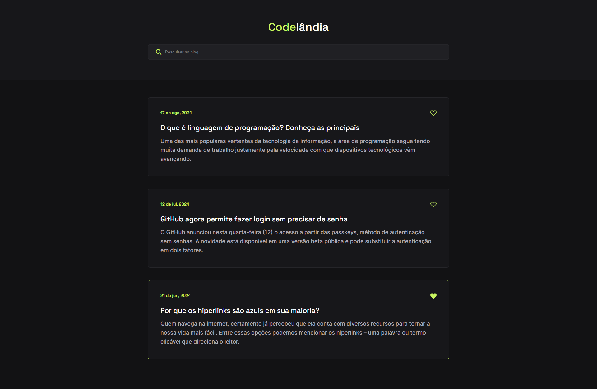

<h1 align="center">Blog - Codelândia</h1>

## Descrição

Este é um projeto criado por <a href="https://github.com/iuricode">Iuri Silva</a>, em sua comunidade do discord chamado <a href="https://www.linkedin.com/company/codelandia-community/">Codelândia</a>. O projeto consiste em criar uma miniatura de como seria um blog com a interatividade de fazer a pesquisa de um blog específico pelo seu nome e a função de gostei no post através do ícone de coração em cada post.

## Tecnologias Utilizadas

## Criação

1 - Comecei com a organização das tags html e criação dos nomes das classes  
2 - Adicionei os estilos a cada elemento.  
3 - Fiz as interatividade necessárias dos elementos que necessitavam.  
4 - Finalizei ajeitando algumas espaços e tamanhos na responsividade do site.  

Tempo de conclusão: cerca de 2 horas.

## Autor

<h3>Matheus Nascimento</h3>

